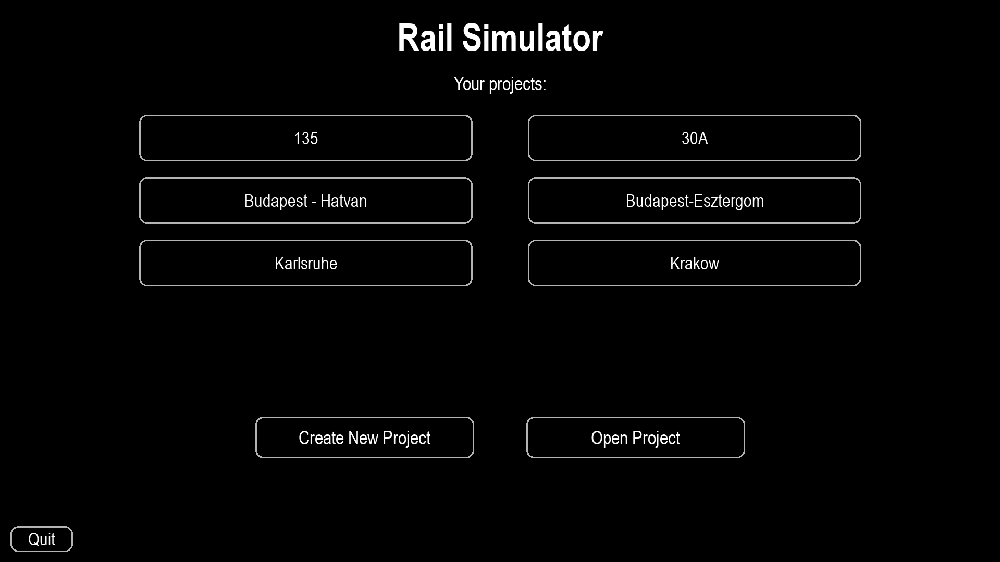
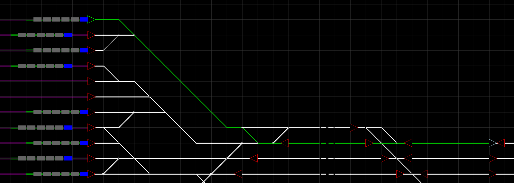
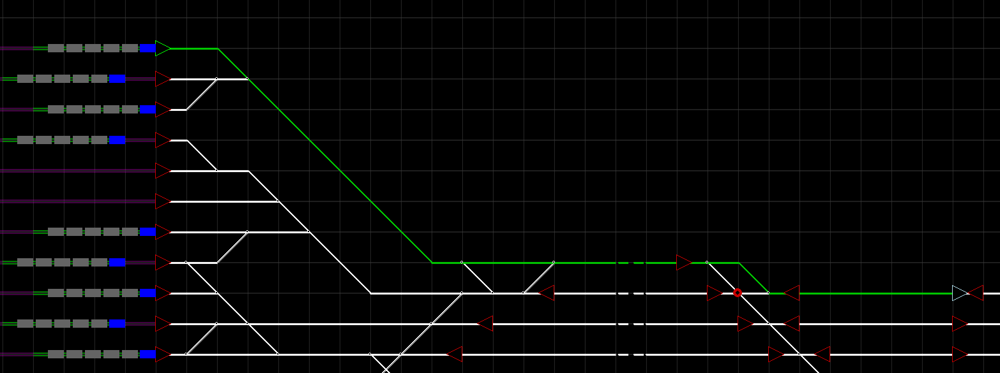

# Rail Simulator: Integrated Railway Planning and Simulation

## Overview

Rail Simulator is a professional-grade decision-support application designed to bridge the gap between railway infrastructure engineering and service-oriented timetable planning. The application implements a **service-first paradigm** where infrastructure developments are derived from desired operational service levels rather than existing physical constraints.

---

## Screenshots

| Project selection | Infrastructure construction |
|---|---|
|  |  |

| Route preview | Route before blockers |
|---|---|
|  |  |

| Route after blockers | Simulation |
|---|---|
|  |  |

| Timetable list | Timetable editor |
|---|---|
|  |  |

| Train status panels | Selected timetable station |
|---|---|
|  |  |

# Functional Capabilities

## Infrastructure Construction

### Topological Modeling
Implements a **graph-based representation** of railway networks where:

- **Nodes** represent discrete geographic coordinates.
- **Edges** represent track segments with defined **speed limits** and **length attributes**.

### Geometric Constraints
Supports complex infrastructure geometry including:
- Flyovers  
- Tunnels  

Physical feasibility is enforced by restricting **invalid track curvature** and unrealistic track geometry.

### Facility Management
Hierarchical modeling of railway facilities:

- Stations
- Platforms

Platforms can be logically linked to the track network, enabling **train stopping and boarding operations**.

### Advanced Signaling
Implements an ETCS level-2 inspired signalling system with manually adjustable signal aspects and interlocking logic. The interlocking logic ensures **safe separation of trains** and prevents route conflicts.

---

# Timetable Engineering

## Periodic Scheduling
Native support for **Integrated Periodic Timetables (ITF)** enabling:

- Predictable repeating schedules
- Passenger-friendly clockface services

## Temporal Logic
Arrival and departure times are **automatically derived** from user-defined dwell times

## Operational Monitoring
During simulation execution the system tracks train punctuality and provides **real-time feedback** on operational performance.

---

# Simulation and Analysis

## Kinematic Dynamics
Train movement simulation includes:

- Acceleration curves
- Deceleration profiles
- Braking distances
- Infrastructure speed limits
- Signal aspects
- Dwell times
- Passenger boarding and alighting times

Vehicle behavior reacts dynamically to signaling and route availability.

## Interlocking and Routing
Route finding and signal path allocation utilize:

- **A\*** pathfinding algorithms
- **Graph traversal techniques**

Routes are automatically established between signaling nodes while maintaining **conflict-free operations**.

## Temporal Control
Simulation runtime can be accelerated using **variable time scaling**, which allows for rapid evaluation of timetable performance over extended periods.

# Technical Architecture

| Component | Technology | Rationale |
|-----------|-----------|-----------|
| Logic Engine | Python | High-level abstraction for rapid manipulation of complex data structures |
| Simulation | Pygame | Framebuffer-based rendering for precise 2D visualization |
| Administration UI | PyQt6 | Event-driven interface for professional data entry |
| Graph Logic | NetworkX | Optimized algorithms for topology and connectivity |
| Persistence | JSON | Human-readable project serialization and portability |